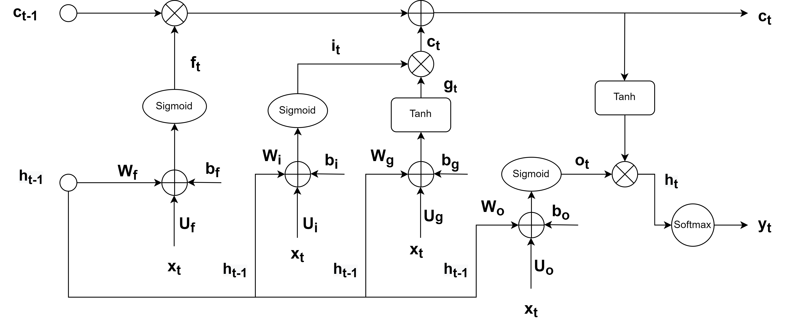
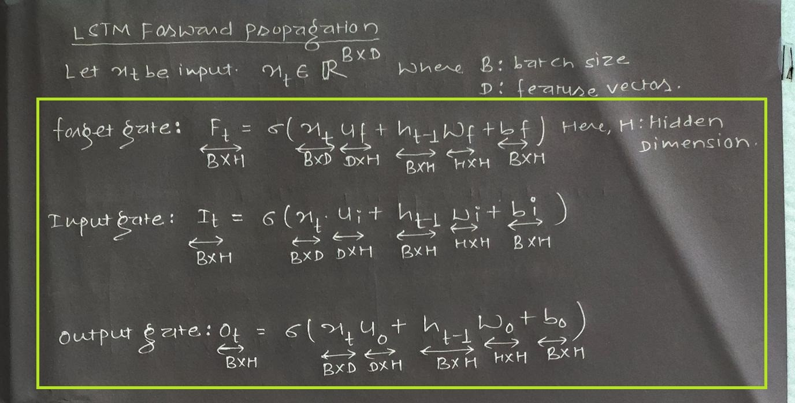
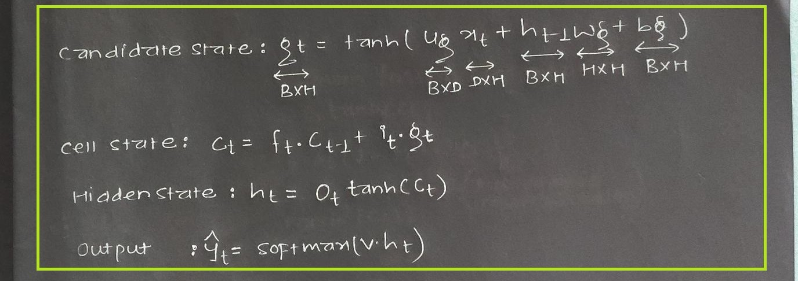
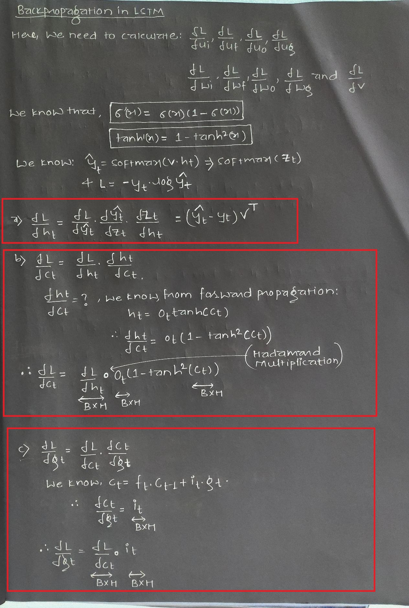
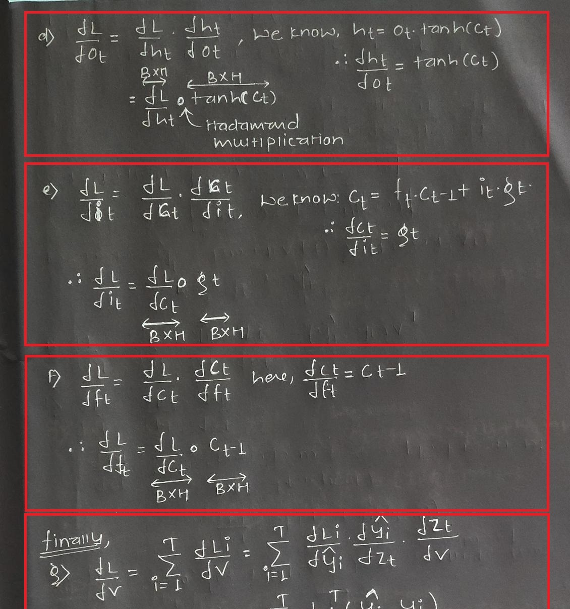
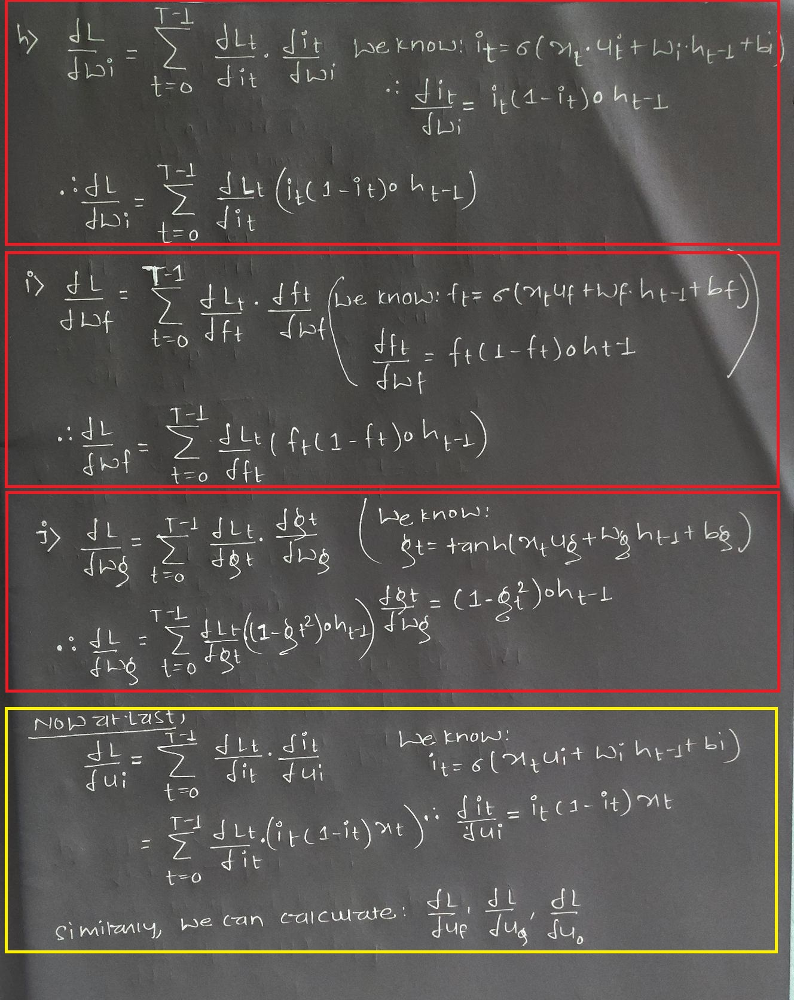

<h1 align='center'>🔩 Nuts and Bolts of LSTM 🔩</h1>

* * * 


Here hidden state is broken into two states: 
1. Cell state($C_t$) : It is called the internal memory where all information will be stored.
2. Hidden state($h_t$) : It is used for computing the output. 

## Forward propagation : 

There are three different gates in an LSTM cell:
* **forget gate** ($f_t$) : It is responsible for deciding what information should be removed from the cell state.  The information from the current input ($x_t$) and the previous hidden state ($h_t$) is passed through the sigmoid activation function. If the output value is closer to 0 means forget, and the closer to 1 means to retain.

* **input gate($i_t$)** : It is responsibel for deciding waht information should be stored in cell state. 
It consists of two parts; first, we pass the previous hidden state ($h_t$) and current input ($x_t$) into a sigmoid function to decide which values will be updated. 
Then, pass the same two inputs into the tanh activation to obtain candidate state($g_t$).The candidate state is calcualted to update the cell state. That is adding new information to cell state. Finally, multiply the tanh output ($g_t$) with the sigmoid output ($i_t$) to decide which information is important to update the cell state. 
* **Cell state($c_t$)** :The input from the previous cell state ($c_{t-1}$) is pointwise multiplied with the forget gate output. If the forget output is 0, then it will discard the previous cell output ($c_{t-1}$). This output is pointwise added with the input gate output to update the new cell state ($c_t$). The present cell state will become the input to the next LSTM unit 
* **output gate($o_t$)**: A lot of information is in cell state(memory). The output gate is responsible for deciding what information should be taken from the cell to give as an output. The output gate regulates the present hidden state ($h_t$). The previous hidden state ($h_{t-1}$) and current input ($x_t$) are passed to the sigmoid function. This output is multiplied with the output of the tanh function to obtain the present hidden state. The current state ($C_t$) and present hidden state ($h_t$) are the final outputs from a classic LSTM unit.  





## Forward propagation in pytorch : 
Initializing weights : 
```
Input Gate : 
W_i = nn.Parameter(torch.Tensor(input_sz, hidden_sz))
U_i = nn.Parameter(torch.Tensor(hidden_sz, hidden_sz))
b_i = nn.Parameter(torch.Tensor(hidden_sz))

Forget Gate: 
W_f = nn.Parameter(torch.Tensor(input_sz, hidden_sz))
U_f = nn.Parameter(torch.Tensor(hidden_sz, hidden_sz))
b_f = nn.Parameter(torch.Tensor(hidden_sz))

Candidate Cell:
W_c = nn.Parameter(torch.Tensor(input_sz, hidden_sz))
U_c = nn.Parameter(torch.Tensor(hidden_sz, hidden_sz))
b_c = nn.Parameter(torch.Tensor(hidden_sz))

Output cell : 
W_o = nn.Parameter(torch.Tensor(input_sz, hidden_sz))
U_o = nn.Parameter(torch.Tensor(hidden_sz, hidden_sz))
b_o = nn.Parameter(torch.Tensor(hidden_sz))
```
Forward pass : 
```
i_t = torch.sigmoid(x_t @ W_i + h_t @ U_i + b_i)
f_t = torch.sigmoid(x_t @ W_f + h_t @ U_f + b_f)
g_t = torch.tanh(x_t @ W_c + h_t @ U_c + b_c)
o_t = torch.sigmoid(x_t @ W_o + h_t @ U_o + b_o)
c_t = f_t * c_t + i_t * g_t
h_t = o_t * torch.tanh(c_t)

```


<!-- 
$$
forget\;gate : f_t = \sigma(x_t\;U_f+ h_{t-1}\;W_f+b_f) 
$$
$$
input\;gate:i_t = \sigma(x_t\;U_i+ h_{t-1}\;W_i+b_i) 
$$
$$
Candidate\;gate:g_t = tanh(x_t\;U_g+ h_{t-1}\;W_g+b_g) 
$$
$$
output\;gate :o_t = \sigma(x_t\;U_o+ h_{t-1}\;W_o+b_o) 
$$

$$
cell\;state: c_{t} = f_t\;c_{t-1} + i_t \; g_t
$$

$$
hidden\;state: h_t = o_t\;tanh(c_t)
$$ -->


## Backward Propagation : 
This is where PyTorch’s autograd comes in. It abstracts the complicated mathematics and helps us “magically” calculate gradients of high dimensional curves with only a few lines of code.
After computing the loss, ```loss.backward()``` automatically performs the backpropagation for us.





## Complete code : 
```python
class CustomLSTM(nn.Module):
    def __init__(self, input_sz: int, hidden_sz: int):
        super().__init__()
        self.input_size = input_sz
        self.hidden_size = hidden_sz

        # i_t
        self.W_i = nn.Parameter(torch.Tensor(input_sz, hidden_sz))
        self.U_i = nn.Parameter(torch.Tensor(hidden_sz, hidden_sz))
        self.b_i = nn.Parameter(torch.Tensor(hidden_sz))

        # f_t
        self.W_f = nn.Parameter(torch.Tensor(input_sz, hidden_sz))
        self.U_f = nn.Parameter(torch.Tensor(hidden_sz, hidden_sz))
        self.b_f = nn.Parameter(torch.Tensor(hidden_sz))

        # c_t
        self.W_c = nn.Parameter(torch.Tensor(input_sz, hidden_sz))
        self.U_c = nn.Parameter(torch.Tensor(hidden_sz, hidden_sz))
        self.b_c = nn.Parameter(torch.Tensor(hidden_sz))

        # o_t
        self.W_o = nn.Parameter(torch.Tensor(input_sz, hidden_sz))
        self.U_o = nn.Parameter(torch.Tensor(hidden_sz, hidden_sz))
        self.b_o = nn.Parameter(torch.Tensor(hidden_sz))

        self.init_weights()

    def init_weights(self):
        stdv = 1.0 / math.sqrt(self.hidden_size)
        for weight in self.parameters():
            weight.data.uniform_(-stdv, stdv)

    def forward(self, x, init_states=None):
        bs, seq_sz, _ = x.size()
        hidden_seq = []

        if init_states is None:
            h_t, c_t = (
                torch.zeros(bs, self.hidden_size).to(x.device),
                torch.zeros(bs, self.hidden_size).to(x.device),
            )
        else:
            h_t, c_t = init_states

        for t in range(seq_sz):
            x_t = x[:, t, :]

            i_t = torch.sigmoid(x_t @ self.W_i + h_t @ self.U_i + self.b_i)
            f_t = torch.sigmoid(x_t @ self.W_f + h_t @ self.U_f + self.b_f)
            g_t = torch.tanh(x_t @ self.W_c + h_t @ self.U_c + self.b_c)
            o_t = torch.sigmoid(x_t @ self.W_o + h_t @ self.U_o + self.b_o)
            c_t = f_t * c_t + i_t * g_t
            h_t = o_t * torch.tanh(c_t)

            hidden_seq.append(h_t.unsqueeze(0))

        # reshape hidden_seq p/ retornar
        hidden_seq = torch.cat(hidden_seq, dim=0)
        hidden_seq = hidden_seq.transpose(0, 1).contiguous()
        return hidden_seq, (h_t, c_t)

```
